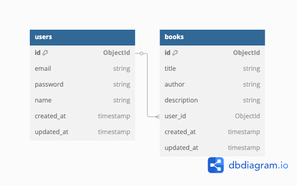
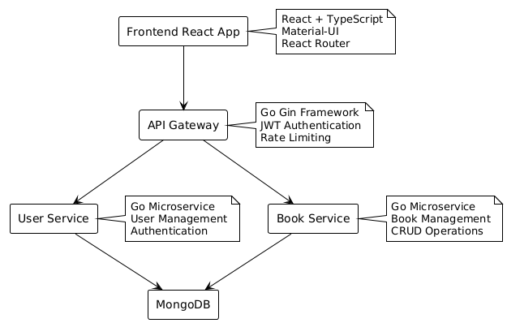
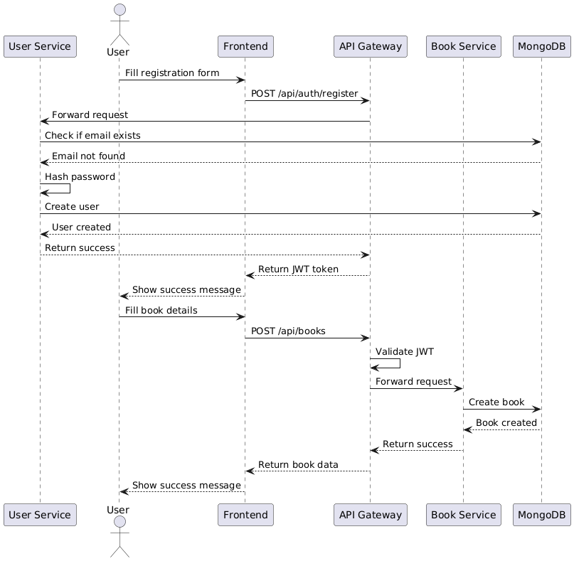

# SmartNotes

SmartNotes is a modern microservices-based application for managing books and user notes. The application provides a seamless experience for users to organize their reading materials and personal notes.

## Features

- User authentication and authorization
- Book management (CRUD operations)
- Note-taking functionality
- Responsive web interface
- Secure API endpoints
- Real-time updates

## Project Structure

```
smartnotes/
├── cmd/                    # Application entry points
├── internal/              # Private application code
│   ├── handlers/         # HTTP request handlers
│   ├── middleware/       # HTTP middleware
│   ├── models/          # Data models
│   └── repositories/    # Database repositories
├── pkg/                  # Public library code
├── smartnotes-frontend/  # React frontend application
└── docker-compose.yml    # Docker configuration
```

## Technical Stack

### Backend
- Go (Gin Framework)
- MongoDB
- JWT Authentication
- Docker

### Frontend
- React
- TypeScript
- Material-UI
- Axios

## Quick Start

### Prerequisites
- Docker and Docker Compose
- Go 1.21+
- Node.js 18+

### Installation

1. Clone the repository:
   ```bash
   git clone <repo_url>
   cd smartnotes
   ```

2. Build and start the project:
   ```bash
   docker-compose up --build
   ```

3. Access the application:
   - Frontend: [http://localhost:3000](http://localhost:3000)
   - Backend API: [http://localhost:3001](http://localhost:3001)
   - MongoDB: `localhost:27017`

## Environment Variables

Create a `.env` file in the root directory with the following variables:

```env
# MongoDB
MONGODB_URI=mongodb://mongo:27017

# JWT
JWT_SECRET=your-secret-key

# Server
PORT=3001
```

## API Documentation

The API documentation is available in OpenAPI format. You can find it in the `TECHNICAL.md` file or access it through the Swagger UI at `http://localhost:3001/swagger/index.html` when the server is running.

### Main Endpoints

- Authentication:
  - `POST /api/auth/register` - Register new user
  - `POST /api/auth/login` - User login

- Books:
  - `GET /api/books` - List all books
  - `POST /api/books` - Create new book
  - `PUT /api/books/:id` - Update book
  - `DELETE /api/books/:id` - Delete book

## Development

### Backend Development

1. Navigate to the backend directory:
   ```bash
   cd cmd/api
   ```

2. Install dependencies:
   ```bash
   go mod download
   ```

3. Run the server:
   ```bash
   go run main.go
   ```

### Frontend Development

1. Navigate to the frontend directory:
   ```bash
   cd smartnotes-frontend
   ```

2. Install dependencies:
   ```bash
   npm install
   ```

3. Start the development server:
   ```bash
   npm start
   ```

## Testing

### Backend Tests
```bash
go test ./...
```

### Frontend Tests
```bash
cd smartnotes-frontend
npm test
```

## Documentation

- [Technical Documentation](TECHNICAL.md) - Detailed technical documentation
- [API Documentation](TECHNICAL.md#api-documentation) - API endpoints and usage
- [Database Schema](docs/database_schema.dbml) - Database structure in dbdiagram.io format
- [Sequence Diagrams](docs/sequence_diagrams.puml) - Business logic flows in PlantUML format

## Contributing

1. Fork the repository
2. Create your feature branch (`git checkout -b feature/amazing-feature`)
3. Commit your changes (`git commit -m 'Add some amazing feature'`)
4. Push to the branch (`git push origin feature/amazing-feature`)
5. Open a Pull Request

## License

This project is licensed under the MIT License - see the LICENSE file for details.

## Support

For support, please open an issue in the GitHub repository or contact the maintainers.

## Диаграммы

### ERD (Entity-Relationship Diagram)



### Архитектурная диаграмма



### Диаграмма бизнес-логики (последовательности)


