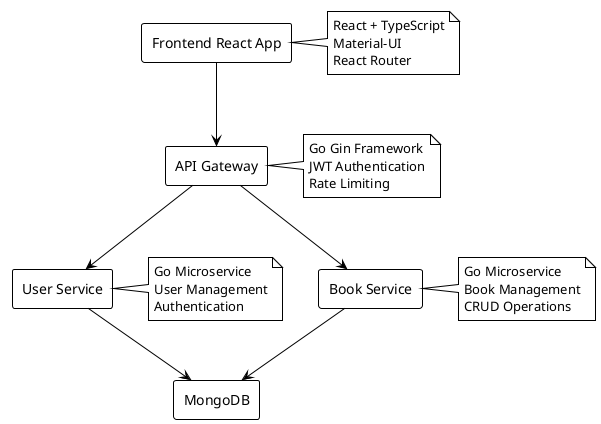
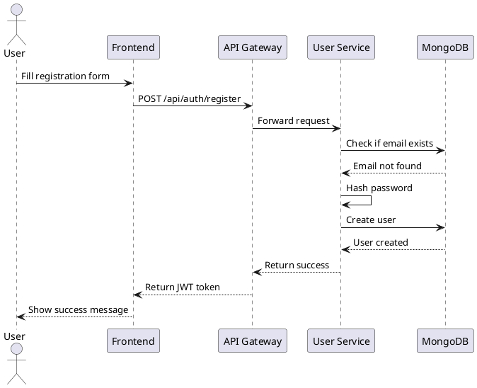
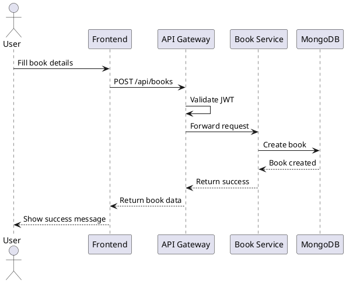

# Technical Documentation

## Architecture Overview

SmartNotes is a microservices-based application built with a modern tech stack. The application follows a clean architecture pattern with clear separation of concerns.

### System Architecture



## Technical Stack

### Backend
- **Language**: Go 1.21+
- **Framework**: Gin Web Framework
- **Database**: MongoDB
- **Authentication**: JWT (JSON Web Tokens)
- **API Documentation**: Swagger/OpenAPI
- **Containerization**: Docker
- **Service Discovery**: Docker Compose

### Frontend
- **Framework**: React 18+
- **Language**: TypeScript
- **UI Library**: Material-UI
- **State Management**: React Context API
- **Routing**: React Router
- **HTTP Client**: Axios

### Development Tools
- **Version Control**: Git
- **Package Management**: 
  - Backend: Go Modules
  - Frontend: npm/yarn
- **Container Management**: Docker & Docker Compose
- **API Testing**: Postman/curl

## Database Schema

```dbml
// Database Schema
Table users {
  id ObjectId [pk]
  email string [unique]
  password string
  name string
  created_at timestamp
  updated_at timestamp
}

Table books {
  id ObjectId [pk]
  title string
  author string
  description string
  user_id ObjectId [ref: > users.id]
  created_at timestamp
  updated_at timestamp
}
```

## API Documentation

### Authentication Endpoints

```yaml
openapi: 3.0.0
info:
  title: SmartNotes API
  version: 1.0.0
  description: API documentation for SmartNotes application

paths:
  /api/auth/register:
    post:
      summary: Register a new user
      requestBody:
        required: true
        content:
          application/json:
            schema:
              type: object
              properties:
                email:
                  type: string
                password:
                  type: string
                name:
                  type: string
      responses:
        '201':
          description: User created successfully
        '400':
          description: Invalid input

  /api/auth/login:
    post:
      summary: Login user
      requestBody:
        required: true
        content:
          application/json:
            schema:
              type: object
              properties:
                email:
                  type: string
                password:
                  type: string
      responses:
        '200':
          description: Login successful
        '401':
          description: Invalid credentials
```

## Sequence Diagrams

### User Registration Flow



### Book Creation Flow



## Security Considerations

1. **Authentication**
   - JWT-based authentication
   - Password hashing using bcrypt
   - Token expiration and refresh mechanism

2. **API Security**
   - Rate limiting
   - Input validation
   - CORS configuration
   - HTTPS enforcement

3. **Data Security**
   - MongoDB connection encryption
   - Environment variable management
   - Secure password storage

## Deployment

The application is containerized using Docker and can be deployed using Docker Compose. The deployment process is automated and includes:

1. Building Docker images
2. Setting up MongoDB
3. Configuring environment variables
4. Starting all services

For detailed deployment instructions, refer to the main README.md file. 